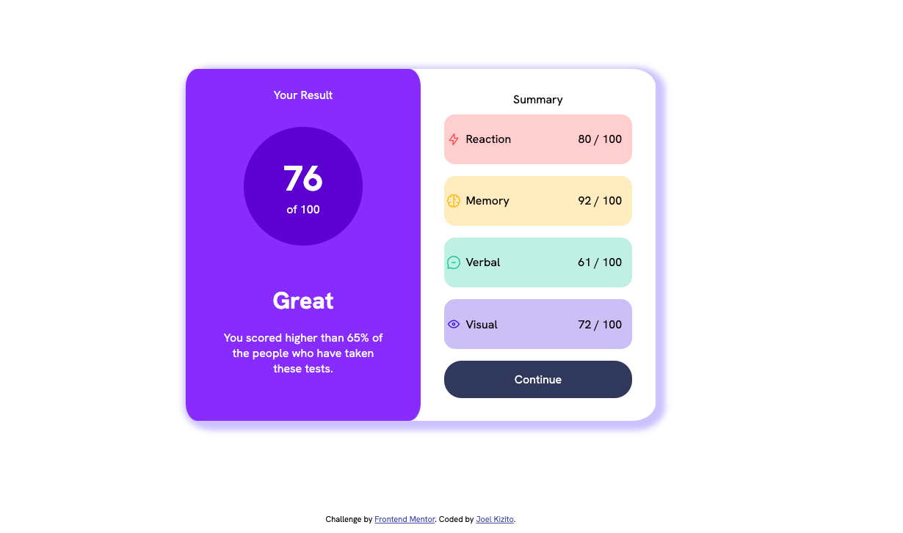

# Frontend Mentor - Results summary component solution

This is a solution to the [Results summary component challenge on Frontend Mentor](https://www.frontendmentor.io/challenges/results-summary-component-CE_K6s0maV). Frontend Mentor challenges help you improve your coding skills by building realistic projects. 

## Table of contents

- [Overview](#overview)
  - [The challenge](#the-challenge)
  - [Screenshot](#screenshot)
  - [Links](#links)
- [My process](#my-process)
  - [Built with](#built-with)
  - [What I learned](#what-i-learned)
  - [Continued development](#continued-development)
- [Author](#author)


## Overview

### The challenge

Users should be able to:

- View the optimal layout for the interface depending on their device's screen size
- See hover and focus states for all interactive elements on the page

### Screenshot




### Links

- Solution URL: https://github.com/kizitojoel/results-summary-component-main.git
- Live Site URL: https://kizitojoel.github.io/results-summary-component-main/

## My process

### Built with

- Semantic HTML5 markup
- CSS custom properties
- Flexbox
- CSS Grid
- Mobile-first workflow

### What I learned


```html
<div class="right-section">
      Summary
      <div class="summary red">
        <div class="summary-section">
          
          Reaction
        </div>
        80 / 100
      </div>
      <div class="summary orange">
        <div class="summary-section">
          
          Memory
        </div>
        92 / 100
      </div>
      <div class="summary teal">
        <div class="summary-section">
          
          Verbal
        </div>
        61 / 100
      </div>
      <div class="summary blue">
        <div class="summary-section">
          
          Visual
        </div>
        72 / 100
      </div>
      <div id="continue">Continue</div>
    </div>
```
```css
@media screen and (max-width: 600px) 
{
    .container
    {
        flex-direction: column;
        width: 90%;
        min-width: none;
        align-items: center;
        justify-content: flex-end;
    }
    .right-section, .left-section
    {
        width: 100%;
        box-sizing: border-box;
        height: 480px;
        margin-top: auto;
        margin-bottom: auto;
    }
}
```


1. Using media queries to make my page more responsive to the user width

### Continued development

- Better use of media queries and use of relative measurements as opposed to fixed measurements
- Gradients in color
- Loading of json into javascript files


## Author

- Website - [Joel Kizito](https://github.com/kizitojoel)
- Frontend Mentor - [kizitojoel](https://www.frontendmentor.io/profile/kizitojoel)
- Twitter - [kizitojoel](https://www.twitter.com/kizitojoel)


